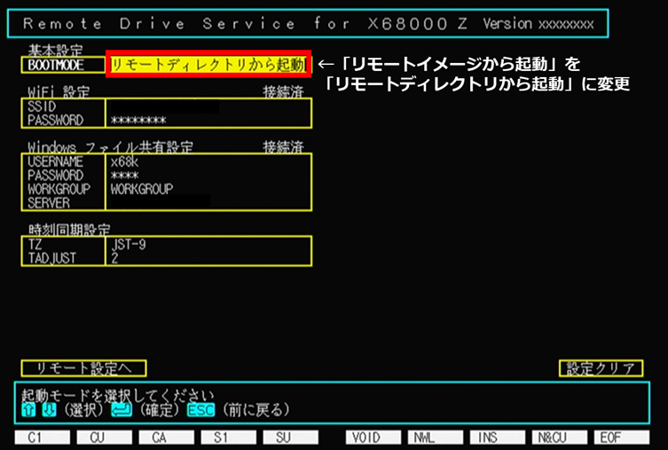

# x68kzremotedrv クイックスタートガイド

x68kzremotedrv の最初の導入のために、Windows PC に X68000 Z とのファイル共有用フォルダを作成して、以下の 2 つのパターンで X68000 Z から参照できるようになるまでの手順を説明します。

* [Case 1. 共有フォルダ上に Human68k システムを作成して、リモートディレクトリとして起動する](#case-1-共有フォルダ上に-human68k-システムを作成してリモートディレクトリとして起動する)
* [Case 2. 既存の USB メモリから起動したシステムから、共有フォルダを参照する](#case-2-既存の-usb-メモリから起動したシステムから共有フォルダを参照する)

## 用意するもの

以下のものを用意します。

* X68000 Z 本体、キーボード、ディスプレイ
* Raspberry Pi Pico W (以下 ラズパイ Pico W)
* USB micro-B ケーブル
* SD カード
* SD カードリーダー (Windows PC で SD カードの読み書きができるもの)
* WiFi ルータ (2.4GHz 帯対応)
* Windows PC
  * WiFi ルータを介して WiFi デバイスからのネットワーク接続が可能になっている必要があります
  * 動作確認は Windows 11 Pro 23H2 で行っています

## 事前準備 (共通)

### X68000 Z の準備 (エミュレータ更新)

X68000 Z は本体アップデート更新データによって ver.x.x.x 以降のバージョンに更新されている必要があります。

[https://www.zuiki.co.jp/x68000z/update/](https://www.zuiki.co.jp/x68000z/update/)

「[本体アップデートマニュアル](https://www.zuiki.co.jp/x68000z/pdf/Update_ver100.pdf)」に従って本体を更新後、「[X68000 エミュレータ](https://www.zuiki.co.jp/x68000z/pdf/Emulator_ver131.pdf)」マニュアルの「1.5.Pseudo SCSI機能について」の記述に従って、USB メモリ内のハードディスクイメージからの起動ができることを確認してください。

### ラズパイ Pico W の準備 (ファームウェア書き込み)

1. ラズパイ Pico W に USB micro-B ケーブルを接続し、基板上の「BOOTSEL」ボタンを**押しながら** Windows PC に接続します。

    

    接続したラズパイ Pico W が PC から USB メモリとして認識されます。`RPI-RP2` というボリューム名で、`INDEX.HTM` と `INFO_UF2.TXT` という 2 つのファイルが中に存在していれば、ラズパイ Pico W はファームウェア書き込みモードに入っています。

    

2. 本アーカイブ ([https://github.com/yunkya2/x68kzremotedrv/releases](https://github.com/yunkya2/x68kzremotedrv/releases) からダウンロードした ZIP ファイル) 内にあるファイル `x68kzremotedrv.uf2` を、このフォルダの中にドラッグ & ドロップします。

    しばらくするとファームウェアの書き込みが完了して、ラズパイ Pico W が再起動します。Windows PC から再度 USB メモリとして認識され、`X68Z REMOTE` というボリューム名の以下のようなドライブとして認識されることを確認します。

    

3. SD カードをカードリーダーに挿入して PC に接続し、`X68000Z` フォルダを作成してラズパイ Pico W 内の `zremotetools.xdf` ファイルをこの中にコピーします。

    

    リモートドライブ設定に必要なファイルがこの FD イメージ (XDFファイル) に入っているので、SD カードを使って X68000 Z からアクセスできるようにします。

### Windows PC の準備 (共有フォルダ作成)

Windows PC 上に X68000 Z とファイル共有するための共有フォルダを作成します。

x68kzremotedrv からの接続は Microsoft アカウントをサポートしていないため、PC にローカルアカウントを追加して、そのアカウントがアクセス可能なフォルダを共有フォルダとして設定します。

1. Windows PC にローカルアカウントを追加します
    * [[Windows11]ローカルユーザーアカウントの登録方法](https://faq.mypage.otsuka-shokai.co.jp/app/answers/detail/a_id/320408) などを参考にローカルアカウントを追加します
    * 以下の説明では、`x68k` という名前でアカウントを作成したものとします

2. ローカルアカウントでアクセス可能な共有フォルダを作成します
    * C ドライブのルートディレクトリに `X68000Z` という名前でフォルダを作成します

    

    * フォルダを右クリック→「プロパティ」→「共有」タブを選択→「ネットワークのファイルとフォルダーの共有」で、`\\<ホスト名>\x68000z` というネットワークパスが共有されるように設定します。

    

    * 「共有」設定で、共有する相手として 1. で作成したローカルアカウント (ここでは `x68k`) を追加して、読み取り/書き込み を許可します。

    

3. 正しく共有設定が行われていれば、Windows エクスプローラのアドレスバーに `\\<ホスト名>` を入力すると 「ネットワーク > <ホスト名>」の中に `X68000Z` フォルダが見えているはずです。

    


## Case 1. 共有フォルダ上に Human68k システムを作成して、リモートディレクトリとして起動する

新規に PC 上の共有フォルダに Human68k システムを作成して、そのフォルダをリモートディレクトリとして起動するための手順を以下に示します。

### 共有フォルダのファイル準備

共有フォルダ内に以下のファイル、フォルダを配置します。

* X68000 Z Z-Club の 「[アップデートファイル一覧](https://dev.zuiki.com/project-z/community/resource)」から「SCSI HDDイメージ (81MB)」をダウンロードして、ZIP ファイル内にあるファイル `SCSIHDD81M.HDS` を `X68000Z` フォルダに置きます
  * ファイル数が増えて 1 ページに収まらなくなっているため、ページ末尾の `>` ボタンでページを移動する必要があります
* `X68000Z` フォルダに `HFS` という名前のフォルダを新規作成します


### リモートイメージからの X68000 Z 起動

1. ファームウェアを書き込んだラズパイ Pico W を X68000 Z 本体の USB ポートに接続します。他の USB メモリや SD カードが刺さっている場合は外してください。

2. X68000 Z 本体の電源を入れて、ゲームランチャーから X68000 エミュレータを起動します。
初回起動の場合、しばらく待つと以下のような設定画面が表示されます。
    * もし「ディスクから起動できません」のメッセージが出る場合は、起動中にキーボードの F1 キーを押したままにしてみてください。
    F1 キーは X68000 エミュレータを起動して X68000 Z のロゴが出た後あたりから押してください

    

3. 設定画面上で Windows ファイル共有にアクセスするための設定を行います。
   設定はキーボードのカーソルキー [↑][↓] で項目を移動して改行キーで選択することで行います。

    * 基本設定
        * `BOOTMODE` は「リモートイメージから起動」を選択します
    * WiFi 設定
        * `SSID` の項目を選択すると、WiFi をスキャンして接続可能なアクセスポイントの一覧が表示されます。
          一覧の中から接続したいアクセスポイントを選択します。
        * `PASSWORD` には WiFi アクセスポイントのパスワードを入力します。入力は `*` でマスクされていますが、TAB キーを押すことで表示とマスクを切り替えることができます。
        * パスワードを入力すると、選択したアクセスポイントへの接続を開始します。設定欄右上の表示が `未接続` → `接続中` → `接続済` と変化していき、接続済になると Windows ファイル共有設定の項目が現れます。
    * Windows ファイル共有設定
        * `USERNAME` と `PASSWORD` には共有フォルダにアクセスするための、ローカルアカウントのユーザ名とパスワードを設定します。
        * `WORKGROUP` には接続先サーバの所属するワークグループ名を設定します。Windows のデフォルト設定から変えていなければ変更の必要はありません。
        * `SERVER` には接続先サーバ名を指定します。サーバ名で接続が上手くいかない場合は IP アドレスでの指定を試してみてください。
        * 接続先サーバ名を入力するとサーバへの接続を開始します。設定欄右上の表示が `未接続` → `接続中` → `接続済` と変化します。

    

    Windows ファイル共有設定が完了すると、「リモート設定へ」項目が選択できるようになるので、この項目を選択してリモート設定画面に進みます。

    * リモートイメージ設定
        * `IMGUNIT` を 1 に指定します
        * この下に `IMAGE0` という項目が現れるので、この項目を選択して `X68000Z` → `SCSIHDD81M.HDS` に設定します。
    * リモートディレクトリ設定
        * `RMTUNIT` を 1 に指定します
        * この下に `REMOTE0` という項目が現れるので、この項目を選択して `X68000Z` → `HFS` → `./` に設定します。

   すべての設定が完了すると以下のような画面になります。`設定終了` を選択すると設定がラズパイ Pico W 内に保存されるので、電源スイッチで一度 X68000 Z の電源を切って、再投入してください。
    * ※ X68000 Z PRODUCT EDITION はリセットボタンでエミュレータホスト環境がリセットされないため、電源断が必要になります。HACKER'S EDITION や EARLY ACCESS KIT の場合は本体のリセットボタンでも大丈夫です。

    

4. X68000 エミュレータを起動すると、HDS ファイル `X68000Z/SCSIHDD81M.HDS` をハードディスクイメージとして起動します。

    起動後に `drive` コマンドを実行すると、以下のように A: ドライブにSCSI ハードディスクイメージが、B: ドライブには「その他のタイプ」としてリモートドライブがあることが確認できます。

    

5. B:ドライブでのファイル操作が、PC に作成した `C:\X68000Z\HFS` フォルダ内のファイルとなります。
現在このフォルダの中は空なので、起動に使用したハードディスクイメージの内容をそのままコピーします。\
X68000 Z のコマンドラインで `copyall A:*.* B:` と入力して、A: ドライブの内容をすべて B: ドライブにコピーします。

    PC の `C:\X68000Z\HFS` フォルダにコピーしたファイルが作成されていることが確認できます。

    

### リモートディレクトリからの起動

1. [「事前準備」](#ラズパイ-pico-w-の準備-ファームウェア書き込み)で作成した SD カードを X68000 Z のドライブ 0 に挿入して、ファイル選択メニューで `zremotetools.xdf` を選択します。

2. 2HD ドライブは C: ドライブになっているので、このドライブの内容を確認します。
`zremote.x`,`zremotedrv.sys`,`zremoteimg.sys` の 3 つのファイルが入っているはずです。このうち、`zremote.x` を B: ドライブのパスの通ったディレクトリ (`BIN` など)、`zremotedrv.sys`,`zremoteimg.sys` をデバイスドライバを入れるディレクトリ (`SYS` など) にコピーします。

    ```
    C>copy zremote.x B:\bin
    zremote           .x
             1 個のファイルをコピーしました
    C>copy *.sys B:\sys
    zremotedrv        .sys
    zremoteimg        .sys
             2 個のファイルをコピーしました
    C>
    ```

    コピーが完了したら、ドライブ 0 のイジェクトボタンを押してから SD カードを抜いてください。

3. `zremote bootmode 0` と入力して、起動モードを「リモートディレクトリからの起動」に切り替えます。

    ````
    B>zremote bootmode 0
    ※設定変更を反映させるためには再起動が必要です
    B>
    ````

    (`zremote` コマンドをオプションを付けずに起動して、以下のように「サーバ設定」画面の「基本設定」`BOOTMODE` を「リモートディレクトリから起動」に設定してもよいです)

    

4. 電源スイッチで一度 X68000 Z の電源を切って再投入してください。

5. X68000 エミュレータを起動すると、`C:\X68000Z\HFS` フォルダ内にコピーされた内容をリモートドライブとしてネットワークブートします。

   起動後に `drive` コマンドを実行すると、起動に使用した A: ドライブがリモートドライブである「その他のタイプ」となっています。

    

以上でリモートディレクトリの設定と、そこからの起動確認ができました。

起動後に `zremote` コマンドを使って、リモートディレクトリやリモートイメージのドライブ数やファイル、ディレクトリの場所を変更することもできます。


## Case 2. 既存の USB メモリから起動したシステムから、共有フォルダを参照する

既に USB メモリから起動するシステムがある場合に、リモートドライブとして共有フォルダを追加する手順を以下に示します。

### X68000 Z の起動とデバイスドライバの組み込み

1. **ラズパイ Pico W を接続せずに**、X68000 Z を USB メモリから通常起動します。

2. [「事前準備」](#ラズパイ-pico-w-の準備-ファームウェア書き込み)で作成した SD カードを X68000 Z のドライブ 0 に挿入して、ファイル選択メニューで `zremotetools.xdf` を選択します。

3. 2HD ドライブに割り当てられているドライブの内容を確認します。
`zremote.x`,`zremotedrv.sys`,`zremoteimg.sys` の 3 つのファイルが入っているはずです。このうち、`zremote.x` を起動ドライブのパスの通ったディレクトリ (`BIN` など)、`zremotedrv.sys`,`zremoteimg.sys` をデバイスドライバを入れるディレクトリ (`SYS` など) にコピーします。

    ```
    C>copy zremote.x A:\bin
    zremote           .x
             1 個のファイルをコピーしました
    C>copy *.sys A:\sys
    zremotedrv        .sys
    zremoteimg        .sys
             2 個のファイルをコピーしました
    C>
    ```

    コピーが完了したら、ドライブ 0 のイジェクトボタンを押してから SD カードを抜いてください。

4. テキストエディタで起動ドライブの `CONFIG.SYS` ファイルを開いて、以下の内容を追加します。
[インストール先] には、3. でデバイスドライバをコピーしたディレクトリ名を指定してください。

    ```
    DEVICE = [インストール先]\zremotedrv.sys
    DEVICE = [インストール先]\zremoteimg.sys
    ```

### ファイル共有設定

1. ラズパイ Pico W を X68000 Z 本体の USB ポートに接続します (再起動は不要です)。

2. `zremote` コマンドをオプションを付けずに実行します。設定メニュー画面が表示されるので、Windows ファイル共有にアクセスするための設定を行います。\
   設定はキーボードのカーソルキー [↑][↓] で項目を移動して改行キーで選択することで行います。

    * 基本設定
        * `BOOTMODE` は「USBメモリから起動」を選択します
    * WiFi 設定
        * `SSID` の項目を選択すると、WiFi をスキャンして接続可能なアクセスポイントの一覧が表示されます。
          一覧の中から接続したいアクセスポイントを選択します。
        * `PASSWORD` には WiFi アクセスポイントのパスワードを入力します。入力は `*` でマスクされていますが、TAB キーを押すことで表示とマスクを切り替えることができます。
        * パスワードを入力すると、選択したアクセスポイントへの接続を開始します。設定欄右上の表示が `未接続` → `接続中` → `接続済` と変化していき、接続済になると Windows ファイル共有設定の項目が現れます。
    * Windows ファイル共有設定
        * `USERNAME` と `PASSWORD` には共有フォルダにアクセスするための、ローカルアカウントのユーザ名とパスワードを設定します。
        * `WORKGROUP` には接続先サーバの所属するワークグループ名を設定します。Windows のデフォルト設定から変えていなければ変更の必要はありません。
        * `SERVER` には接続先サーバ名を指定します。サーバ名で接続が上手くいかない場合は IP アドレスでの指定を試してみてください。
        * 接続先サーバ名を入力するとサーバへの接続を開始します。設定欄右上の表示が `未接続` → `接続中` → `接続済` と変化します。

    Windows ファイル共有設定が完了すると、「リモート設定へ」項目が選択できるようになるので、この項目を選択してリモート設定画面に進みます。

    * リモートディレクトリ設定
        * `RMTUNIT` を 1 に指定します
        * この下に `#0 (?:)` という項目が現れるので、この項目を選択して `X68000Z` → `./` に設定します。

   すべての設定が完了すると以下のような画面になります。`設定終了` を選択すると設定がラズパイ Pico W 内に保存されるので、リセットボタンを押して X68000 Z を再起動してください。

    

3. USB メモリから再起動すると、起動時に以下のメッセージが表示されてリモートディレクトリへのアクセスが可能になります

    ```
    X68000 Z Remote Drive Driver (version xxxxxxxx)
    ドライブx:でリモートディレクトリが利用可能です

    X68000 Z Remote Image Driver (version xxxxxxxx)
    zremoteimg.sysが登録できませんでした
    ```

    (リモートイメージの設定がないため zremoteimg.sys の登録に失敗しますが正常です)


リモートディレクトリにファイルを作成すると、PC の `X68000Z` フォルダに同じファイルが見えるようになっていることを確認してみてください。

起動後に `zremote` コマンドを使って、リモートディレクトリやリモートイメージのドライブ数やファイル、ディレクトリの場所を変更することもできます。


## トラブルシューティング

* WiFi 設定が `接続済` 状態にならない
    * ==> WiFi の SSID またはパスワード設定に誤りがあります
    * ラズパイ Pico W の WiFi は 2.4GHz 帯のみをサポートしています。5GHz 帯を使用する 802.11a のアクセスポイントには接続できないことに注意してください
* Windows ファイル共有が `接続済` 状態にならない
    * ==> Windows ファイル共有のサーバ名やユーザ名、パスワード設定に誤りがあります。
    * 接続先サーバ名の名前解決ができない場合は IP アドレスを指定してみてください。
    * ファイル共有のユーザ名にはマイクロソフトアカウントは使用できません。サーバ上にローカルアカウントを作成してそれを指定し、ファイル共有もローカルアカウントに対してアクセス許可を与えるようにしてください。
* 起動時に F1 キーを押しても設定画面が出ない
    * X68000 エミュレータの起動中に USB キーボードのリセットが行われているようで、エミュレータ起動前からキーを押したままにしても認識されません。エミュレータの "X68000 Z" ロゴが出て数秒待ってから押すと良いようです。
