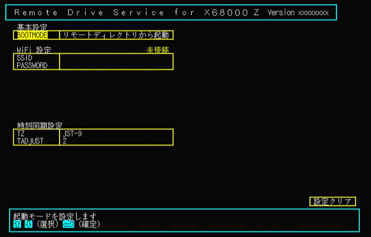
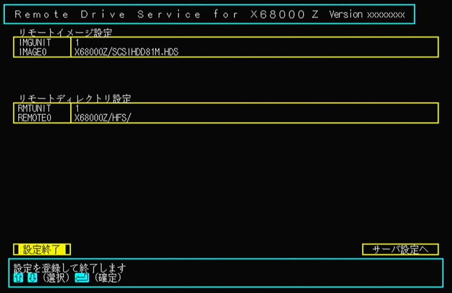

# x68kzremotedrv クイックスタートガイド

x68kzremotedrv の最初の導入のために、Windows PC に X68000Z とのファイル共有用フォルダを作成してそこから X68000Z をネットワークブートできるようになるまでの手順を説明します。

## ハードウェア構成

以下の構成のハードウェアが用意されていることを前提とします。

* X68000Z 本体、キーボード、ディスプレイ
* Raspberry Pi Pico W (以下 ラズパイ Pico W)
* USB micro-B ケーブル
* WiFi ルータ (2.4GHz 帯対応)
* Windows PC
  * WiFi ルータを介して WiFi デバイスからのネットワーク接続が可能になっている必要があります
  * 動作確認は Windows 11 Pro 22H2 で行っています

## X68000Z 側の準備

X68000Z は本体アップデート更新データによって ver.1.3.1 以降のバージョンに更新されている必要があります。

[https://www.zuiki.co.jp/x68000z/update/](https://www.zuiki.co.jp/x68000z/update/)

「[本体アップデートマニュアル](https://www.zuiki.co.jp/x68000z/pdf/Update_ver100.pdf)」に従って本体を更新後、「[X68000 エミュレータ](https://www.zuiki.co.jp/x68000z/pdf/Emulator_ver131.pdf)」マニュアルの「1.5.Pseudo SCSI機能について」の記述に従って、USB メモリ内のハードディスクイメージからの起動ができることを確認してください。

## Windows PC 側の準備

1. C ドライブのルートディレクトリに `X68000Z` という名前でフォルダを作成し、フォルダを右クリック→「プロパティ」→「共有」タブを選択→「ネットワークのファイルとフォルダーの共有」で、`\\<ホスト名>\x68000z` というネットワークパスが共有されるように設定します。

    

    

2. 正しく共有設定が行われていれば、Windows エクスプローラのアドレスバーに `\\<ホスト名>` を入力すると 「ネットワーク > <ホスト名>」の中に `X68000Z` フォルダが見えているはずです。

    

3. 共有フォルダが作成出来たら、その中に以下のファイル、フォルダを配置します。
    * X68000Z Z-Club の 「[ソフト一覧](https://dev.zuiki.com/project-z/community/resource)」から「SCSI HDDイメージ (81MB)」をダウンロードして、ZIP ファイル内にあるファイル `SCSIHDD81M.HDS` を `X68000Z` フォルダに置きます
    * `X68000Z` フォルダに `HFS` という名前のフォルダを新規作成します

    

## ラズパイ Pico W 側の準備

1. ラズパイ Pico W に USB micro-B ケーブルを接続し、基板上の「BOOTSEL」ボタンを**押しながら** Windows PC に接続します。

    

    接続したラズパイ Pico W が PC から USB メモリとして認識されます。`RPI-RP2` というボリューム名で、`INDEX.HTM` と `INFO_UF2.TXT` という 2 つのファイルが中に存在していれば、ラズパイ Pico W はファームウェア書き込みモードに入っています。

    

2. 本アーカイブ ([https://github.com/yunkya2/x68kzremotedrv/releases](https://github.com/yunkya2/x68kzremotedrv/releases) からダウンロードした ZIP ファイル) 内にあるファイル `x68kzremotedrv.uf2` を、このフォルダの中にドラッグ & ドロップします。

    しばらくするとファームウェアの書き込みが完了して、ラズパイ Pico W が再起動します。Windows PC から再度 USB メモリとして認識され、`X68000Z`、`config.txt`、`log.txt` の 3 つのファイル/フォルダが存在することを確認します。

    

3. ファームウェアが書き込まれていることが確認できたら、ラズパイ Pico W を PC から X68000Z に差し替えます。

## X68000Z の起動 (HDS ファイル)

1. ラズパイ Pico W が接続されている状態で X68000Z 本体の電源を入れて、ゲームランチャーから X68000 エミュレータを起動します。
初回起動の場合、しばらく待つと以下のような設定画面が表示されます。\
    もし「ディスクから起動できません」のメッセージが出たり Human68k が普通に起動してしまう場合は、起動中にキーボードの F1 キーを押したままにしてみてください。\
    (F1 キーは X68000 エミュレータを起動して X68000 Z のロゴが出た後あたりから押してください)

    

2. 設定画面上で Windows ファイル共有にアクセスするための設定を行います。\
   設定はキーボードのカーソルキー [↑][↓] で項目を移動して改行キーで選択することで行います。

    * WiFi 設定
        * `SSID` の項目を選択すると、WiFi をスキャンして接続可能なアクセスポイントの一覧が表示されます。
          一覧の中から接続したいアクセスポイントを選択します。
        * `PASSWORD` には WiFi アクセスポイントのパスワードを入力します。入力は `*` でマスクされていますが、TAB キーを押すことで表示とマスクを切り替えることができます。
        * パスワードを入力すると、選択したアクセスポイントへの接続を開始します。設定欄右上の表示が `未接続` → `接続中` → `接続済` と変化していき、接続済になると Windows ファイル共有設定の項目が現れます。
    * Windows ファイル共有設定
        * `USERNAME` と `PASSWORD` には共有フォルダにアクセスするためのユーザ名とパスワードを設定します。
        * `WORKGROUP` には接続先サーバの所属するワークグループ名を設定します。Windows のデフォルト設定から変えていなければ変更の必要はありません。
        * `SERVER` には接続先サーバ名を指定します。サーバ名で接続が上手くいかない場合は IP アドレスでの入力を試してみてください。
        * 接続先サーバ名を入力すると、設定したサーバへの接続を開始します。設定欄右上の表示が `未接続` → `接続中` → `接続済` と変化していき、接続済になると HDS とリモートドライブ設定の項目が現れます。
    * HDS (SCSI ディスクイメージ) 設定
        * X68000Z に接続する HDS ファイルを共有フォルダの中から指定します。`HDS0` を選択するとサーバの共有フォルダの共有名一覧が表示されるので、`X68000Z` → `SCSIHDD81M.HDS` に設定します。
    * リモートドライブ設定
        * X68000Z に接続するリモートドライブを共有フォルダの中から指定します。
        * まずは `RMTBOOT` を 0 のまま (HDS ファイルから起動)、`RMTUNIT` を 1 に指定します。`RMTUNIT` の指定によって `REMOTE0` 項目が現れます。
        * `REMOTE0` を選択するとサーバの共有フォルダの共有名一覧が表示されるので、`X68000Z` → `HFS` → `./` に設定します。

   すべての設定が完了すると以下のような画面になります。`設定終了` を選択すると設定がラズパイ Pico W 内に保存されるので、電源スイッチで一度 X68000Z の電源を切って、再投入してください。

   ※ X68000 Z PRODUCT EDITION はリセットボタンでエミュレータホスト環境がリセットされないため、電源断が必要になります。HACKER'S EDITION や EARLY ACCESS KIT の場合は本体のリセットボタンでも大丈夫です。

    

3. X68000 エミュレータを起動すると、HDS ファイル `X68000Z/SCSIHDD81M.HDS` をハードディスクイメージとして起動します。

    起動後に `drive` コマンドを実行すると、以下のように A: ドライブにSCSI ハードディスクイメージが、B: ドライブには「その他のタイプ」としてリモートドライブがあることが確認できます。

    

4. B:ドライブでのファイル操作が、PC に作成した `C:\X68000Z\HFS` フォルダ内のファイルとなります。
現在このフォルダの中は空なので、起動に使用したハードディスクイメージの内容をそのままコピーします。\
X68000Z のコマンドラインで `copyall A:*.* B:` と入力して、A: ドライブの内容をすべて B: ドライブにコピーします。

    PC の `C:\X68000Z\HFS` フォルダにコピーしたファイルが作成されていることが確認できます。

    

## X68000Z の起動 (リモートドライブ)

1. 設定変更のために X68000Z を一度リセットします。再起動中は F1 キーを押したままにして設定画面を出します。

2. リモートドライブ設定の `RMTBOOT` を 0 から 1 に変更します。これによって、HDS ファイルからの起動がリモートドライブからの起動に切り替わります。

    

   `設定終了` を選択後、電源スイッチで一度 X68000Z の電源を切って再投入してください。

3. X68000 エミュレータを起動すると、`C:\X68000Z\HFS` フォルダ内にコピーされた内容をリモートドライブとしてネットワークブートします。

   起動後に `drive` コマンドを実行すると、起動に使用した A: ドライブがリモートドライブである「その他のタイプ」となっています。

    

以上でリモートドライブの設定と、そこからネットワークブートできることの確認ができました。

起動時に F1 キーを押して表示される設定画面で設定を変更することで、リモートドライブを最大 4 台まで追加したり、複数の HDS ファイルを認識させることもできるようになります。

## トラブルシューティング

* WiFi 設定が `接続済` 状態にならない
    * ==> WiFi の SSID またはパスワード設定に誤りがあります
    * ラズパイ Pico W の WiFi は 2.4GHz 帯のみをサポートしています。5GHz 帯を使用する 802.11a のアクセスポイントには接続できないことに注意してください
* Windows ファイル共有が `接続済` 状態にならない
    * ==> Windows ファイル共有のサーバ名やユーザ名、パスワード設定に誤りがあります。
    * 接続先サーバ名の名前解決ができない場合は IP アドレスを指定してみてください。
    * ファイル共有のユーザ名にはマイクロソフトアカウントは使用できません。サーバ上にローカルアカウントを作成してそれを指定し、ファイル共有もローカルアカウントに対してアクセス許可を与えるようにしてください。
* 起動時にリモートドライブサービスの認識に失敗することがある(「ディスクから起動できません」と表示される)
    * 通常使用時は、ラズパイ Pico W から WiFi ルータと Windows ファイル共有への接続が完了した後で X68000Z から認識されるようになるのですが、環境によってはこのタイミングが遅くて X68000Z 側の認識処理に間に合わないことがあるようです。
    * 回避手段として、設定項目に `FASTCONN` (リモートドライブサービスの接続を高速化する) を追加しました。通常はこの項目は 0 のままで良いですが、認識に失敗する際は 1 にしてみてください。
    * 1 にすると X68000Z からの認識が高速化される一方で、すべての HDS ファイルが約4GBのファイルとして扱われるという副作用があります。フォーマット済みのディスクイメージを使用する限りはこの副作用が問題になることはありませんが、新規にディスクイメージファイルを用意して format.x の「装置初期化」でイメージファイルを初期化する場合、ファイルサイズが正常に認識されないため正しくフォーマットが行えなくなります。このような場合は `FASTCONN=0` にするか、エミュレータ等他の環境で作成したフォーマット済みの HDS ファイルを使用するようにしてください。
* 起動時に F1 キーを押しても設定画面が出ない
    * X68000 エミュレータの起動中に USB キーボードのリセットが行われているようで、エミュレータ起動前からキーを押したままにしても認識されません。エミュレータの "X68000 Z" ロゴが出て数秒待ってから押すと良いようです。
    * SRAM 常駐型のブートセレクタを使用している場合は、SCSI ID 6 から起動することで設定画面が表示されます
    * 設定内容によっては (HDS イメージもリモートドライブもない状態で設定を保存してしまうなど) 設定画面を出すことができなくなってしまう場合があります。この対策として、FD 起動して設定画面を出すことのできるレスキューディスクイメージ (`zrmtrescue.xdf`) を用意しました。SD カードの `X68000Z` フォルダに入れてこのイメージファイルから起動することで、設定画面が表示されるようになります。
