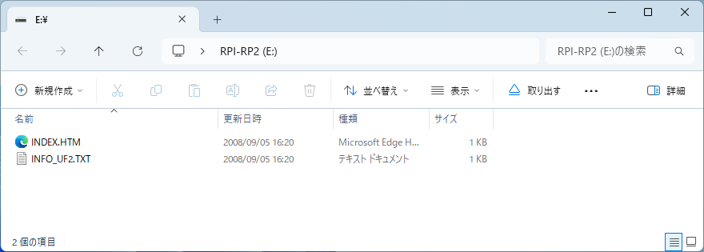
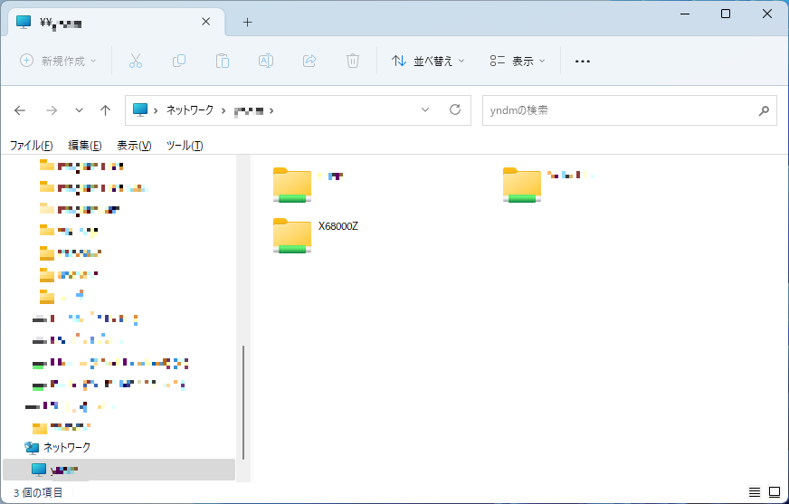

# x68kzremotedrv クイックスタートガイド

x68kzremotedrv の最初の導入のために、Windows PC に X68000Z とのファイル共有用フォルダを作成してそこから X68000Z をネットワークブートできるようになるまでの手順を説明します。

## ハードウェア構成

以下の構成のハードウェアが用意されていることを前提とします。

* X68000Z 本体、キーボード、ディスプレイ
* Raspberry Pi Pico W (以下 ラズパイ Pico W)
* USB micro-B ケーブル
* WiFi ルータ (2.4GHz 帯対応)
* Windows PC
  * WiFi ルータを介して WiFi デバイスからのネットワーク接続が可能になっている必要があります
  * 動作確認は Windows 11 Pro 22H2 で行っています

## X68000Z 側の準備

X68000Z は 2023 年 7 月 28 日配布開始の本体アップデート更新データによって ver.1.3.1 に更新されている必要があります。

[https://www.zuiki.co.jp/x68000z/update/](https://www.zuiki.co.jp/x68000z/update/)

「[本体アップデートマニュアル](https://www.zuiki.co.jp/x68000z/pdf/Update_ver100.pdf)」に従って本体を更新後、「[X68000 エミュレータ](https://www.zuiki.co.jp/x68000z/pdf/Emulator_ver131.pdf)」マニュアルの「1.5.Pseudo SCSI機能について」の記述に従って、USB メモリ内のハードディスクイメージからの起動ができることを確認してください。

## Windows PC 側の準備

1. C ドライブのルートディレクトリに `X68000Z` という名前でフォルダを作成し、フォルダを右クリック→「プロパティ」→「共有」タブを選択→「ネットワークのファイルとフォルダーの共有」で、`\\<ホスト名>\x68000z` というネットワークパスが共有されるように設定します。

    

    

2. 正しく共有設定が行われていれば、Windows エクスプローラのアドレスバーに `\\<ホスト名>` を入力すると 「ネットワーク > <ホスト名>」の中に `X68000Z` フォルダが見えているはずです。

    

3. 共有フォルダが作成出来たら、その中に以下のファイル、フォルダを配置します。
    * X68000Z Z-Club の 「[ソフト一覧](https://dev.zuiki.com/project-z/community/resource)」から「SCSI HDDイメージ (81MB)」をダウンロードして、ZIP ファイル内にあるファイル `SCSIHDD81M.HDS` を `X68000Z` フォルダに置きます
    * `X68000Z` フォルダに `HFS` という名前のフォルダを新規作成します

    

## ラズパイ Pico W 側の準備

1. ラズパイ Pico W に USB micro-B ケーブルを接続し、基板上の「BOOTSEL」ボタンを**押しながら** Windows PC に接続します。

    

    接続したラズパイ Pico W が PC から USB メモリとして認識されます。`RPI-RP2` というボリューム名で、`INDEX.HTM` と `INFO_UF2.TXT` という 2 つのファイルが中に存在していれば、ラズパイ Pico W はファームウェア書き込みモードに入っています。

    

2. 本アーカイブ ([https://github.com/yunkya2/x68kzremotedrv/releases](https://github.com/yunkya2/x68kzremotedrv/releases) からダウンロードした ZIP ファイル) 内にあるファイル `x68kzremotedrv.uf2` を、このフォルダの中にドラッグ & ドロップします。

    しばらくするとのファームウェアの書き込みが完了して、ラズパイ Pico W が再起動します。Windows PC から再度 USB メモリとして認識され、`X68000Z`、`config.txt`、`log.txt` の 3 つのファイル/フォルダが存在することを確認します。

    

3. Windows の 「メモ帳」でこの中の `config.txt` を開いて、設定の各項目を以下のように書き換えます。

    * `WIFI_SSID` には使用している WiFi ルータの SSID の値を設定します
    * `WIFI_PASSWORD` には使用している WiFi ルータのパスワードを設定します
    * `SMB2_USERNAME` には Windows PC のサインインに使用しているユーザ名を設定します
    * `SMB2_PASSWORD` には Windows PC のサインインに使用しているパスワードを設定します
    * 独自のワークグループを設定している場合は、`SMB2_WORKGROUP` にワークグループ名を設定します。デフォルトでは `WORKGROUP` と書かれているので、デフォルト設定から変えていなければそのままで大丈夫です
    * `SMB2_SERVER` には Windows PC のホスト名を設定します
    * `SMB2_SHARE` には `X68000Z` と設定します
    * `ID0` ～ `ID6` は以下の値を設定します
      * `ID0` は `SCSIHDD81M.HDS` (Z-Club からダウンロードしてきた HDD イメージファイル名)
      * `ID1` は `HFS` (`X68000Z` フォルダに作成したフォルダ名)
      * `ID2` ～`ID6` は空欄のまま
    * `TZ` にはタイムスタンプ変換のためのタイムゾーンを設定しますが、特に必要がなければデフォルトの `JST-9` のままで大丈夫です

    

    設定の書き換え後に「メモ帳」アプリで「ファイル」→「保存」 (または `CTRL+S` を押す) でファイルを上書き保存すると、一旦 USB メモリの接続が解除された後に再認識されます。

4. `X68000Z` フォルダの中に以下のファイルがあれば、ラズパイ Pico W の準備は完了です。
    * サイズ 83,968KB の `disk0.hds`
    * サイズ 2,097,152KB の `disk1.hds`
    * 以下の内容が書かれたファイル `pscsi.ini`
        ```
        [pscsi]
        ID0=disk0.hds
        ID1=disk1.hds
        ```

## X68000Z の起動 (HDS ファイル)

1. 設定が完了したラズパイ Pico W を PC から X68000Z に差し替えて X68000Z 本体の電源を入れ、ゲームランチャーから X68000 エミュレータを起動します。\
USB メモリの代わりに、`X68000Z` フォルダの `SCSIHDD81M.HDS` をハードディスクイメージが起動します。

    起動後に `drive` コマンドを実行すると、以下のように A: ドライブにSCSI ハードディスクイメージが、B: ドライブには「その他のタイプ」としてリモートドライブがあることが確認できます。

    

2. B:ドライブでのファイル操作が、PC に作成した `C:\X68000Z\HDS` フォルダ内のファイルとなります。
現在このフォルダの中は空なので、起動に使用したハードディスクイメージの内容をそのままコピーします。\
X68000Z のコマンドラインで `copyall A:*.* B:` と入力して、A: ドライブの内容をすべて B: ドライブにコピーします。

    PC の `C:\X68000Z\HDS` フォルダにコピーしたファイルが作成されていることが確認できます。

    

3. コピーが完了したら、一度 X68000Z の電源を切ります。

## X68000Z の起動 (リモートドライブ)

1. 設定変更のために、ラズパイ Pico W を X68000Z から抜いて Windows PC に差し替えます。`config.txt` を開いて、`ID0:`、`ID1` の内容を以下のようにします。
    * `ID0` は `HFS`
    * `ID1` を空欄にする

    

2. ラズパイ Pico W を再度 PC から X68000Z に差し替えて X68000Z 本体の電源を入れ、ゲームランチャーから X68000 エミュレータを起動します。
すると、`C:\X68000Z\HDS` フォルダ内にコピーされた内容をリモートドライブとして、X68000Z がネットワークブートします。

   起動後に `drive` コマンドを実行すると、起動に使用した A: ドライブがリモートドライブである「その他のタイプ」となっています。

    

以上でリモートドライブの設定と、そこからネットワークブートできることの確認ができました。

ラズパイ Pico W の `config.txt` ファイルの `ID0` ～ `ID6` の設定を変更することで、リモートドライブを別のフォルダに変更したり、複数の HDS ファイルを認識させることもできるようになります。
