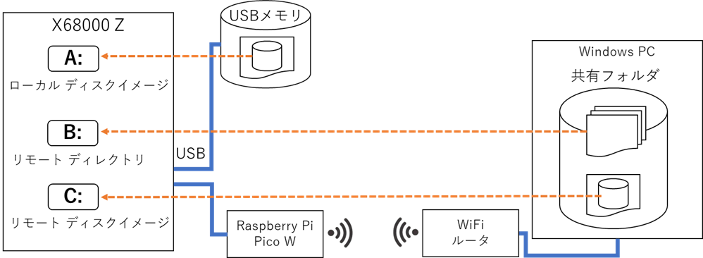

# x68kzremotedrv - X68000 Z リモートドライブサービス

## 概要

x68kzremotedrv は、[X68000 Z](https://www.zuiki.co.jp/x68000z/) に無線 LAN を搭載したボードコンピュータ [Raspberry Pi Pico W](https://www.raspberrypi.com/documentation/microcontrollers/raspberry-pi-pico.html) を接続して、ネットワーク上の Windows PC 内のファイルをリモートドライブとして利用できるようにします。

20240120 以前のバージョンではエミュレータの Pseudo SCSI 機能を用いて疑似的に Pico W との間の通信路を実現していましたが、[ZUSB](https://github.com/yunkya2/x68kz-zusb) により USB デバイスへの直接アクセスが出来るようになったため、リモートドライブ専用の USB デバイスとして動作するようになりました。

## できること

* Windows PC の共有ファイル・フォルダへのアクセス
  * Windows PC のファイル共有機能 (SMB) で共有されたファイルやフォルダに X68000 Z からアクセスできます。
  * リモートディレクトリ
    * 共有フォルダ内の特定のフォルダにドライブ名を割り当てて、フォルダ内のファイルを X68000 Z から参照できます。
    * PC 上のファイルを直接 X68000 Z から利用できます。HUMAN.SYS や CONFIG.SYS など、起動に必要なファイルがあればリモートディレクトリからの起動も可能です。
  * リモートイメージ
    * 共有ファイルを X68000 の SCSI ディスクイメージ (HDSファイル) として X68000 Z から参照できます。リモートイメージからの起動も可能です。
    * PC 用の既存の X68k エミュレータで使用している HDS ファイルを PC 上に置いたまま利用することができます。
* Windows PC との時刻同期
  * X68000 Z の時刻を Windows PC の時刻に合わせることができます
  * X68000 Z は外部との時刻合わせの機能がないため時計が狂いがちですが、ネットワークで時刻同期されている PC に合わせることで正確な時刻を得ることができます
* ローカルの SCSI ディスクイメージとリモートドライブの併用 (ZUSB 対応版新機能)
  * X68000 Z 本体に接続した USB メモリによる SCSI ディスクイメージとリモートドライブの併用が可能です
  * USB メモリを用いてシステムを起動して、ユーザファイルは PC 上の共有ファイルを利用するといった使い方ができます
* Human68k のコマンドラインからの設定変更 (ZUSB 対応版新機能)
  * 従来の x68kzremotedrv では起動時の設定メニューからのみ設定変更が可能でしたが、Human68k の起動後にコマンドラインや設定メニューを用いた設定変更が可能になりました
    * ドライブ数が変わるような設定変更を反映させるには再起動が必要です

## 必要なもの

X68000 Z 本体に加えて以下が必要です。

* [Raspberry Pi Pico W](https://www.raspberrypi.com/documentation/microcontrollers/raspberry-pi-pico.html) (以下、ラズパイ Pico W)
  * ラズパイ Pico にはいくつか製品バリエーションがありますが、W が付かないものは無線 LAN 機能を持たないため使用できません
  * Pico W (ヘッダピンなし)、Pico WH (ヘッダピン付き) のどちらでも使用できます
  * **Raspberry Pi Pico 2 W には対応していません。**「2」の付かない Pico W を使用してください。
* USB micro-B ケーブル
  * ラズパイ Pico W を X68000 Z に接続したり、ファームウェア書き込みのため PC に接続したりするために必要です
* 接続先となる Windows PC、WiFi ルータ

## 使用方法

リリースアーカイブ内のファームウェアファイル (x68kzremotedrv.uf2) をラズパイ Pico W に書き込み後、X68000 Z に接続して設定を行います。

設定方法については [クイックスタートガイド](QUICKSTART.md) を参照してください。

X68000 Z 上でのコマンドの使用方法などについては [リファレンスドキュメント](Reference.md) を参照してください。

## 注意と制約事項

* ネットワーク接続のパスワード情報などはラズパイ Pico W の中に平文で記録されます。接続情報を設定した Pico W の管理にはご注意ください。
  * 以下の方法でラズパイ Pico W 内の設定データやファームウェアをクリアできます。ラズパイ Pico W を別の用途に使用する際などに利用してください。
    1. micro-B ケーブルでラズパイ Pico W を PC に接続する
    2. Pico W が PC に認識されてエクスプローラに「X68Z REMOTE」という名前のドライブが表示されるまで待つ
    3. 「X68Z REMOTE」ドライブ内の「erase」フォルダを開く
    4. フォルダ内にあるファイルのうち以下のものをメモ帳で開く
       * 設定データのみをクリアするなら erase_config.txt
       * ファームウェアを完全消去するなら erase_all.txt
    5. メモ帳で開いたファイルをそのまま**上書き保存**する
* リモートドライブには現状、以下の制約事項があります。
  * リモートドライブ上ではファイルアトリビュートの隠しファイルやシステム属性、書き込み禁止属性などは無視されます
  * Human68k の DSKFRE が 2GB 以上のディスクサイズを想定していないため、ドライブの残容量表示は不正確です

## ビルド方法

ソースコードからのビルドは Windows 11 上の WSL2 で行います。事前に [elf2x68k](https://github.com/yunkya2/elf2x68k) と [Raspberry Pi Pico C/C++ SDK](https://www.raspberrypi.com/documentation/microcontrollers/c_sdk.html) のセットアップが必要です。

1. 必要な環境のをセットアップした PC に本リポジトリを clone します (要 --recursive オプション)。
2. `make` を実行するとビルドを開始します。
3. ビルドが完了すると生成されるファイル、`build/x68kremotedrv.uf2` がラズパイ Pico W へ書き込むファイルとなります。

## 謝辞

Human68k のリモートドライブの実装は以下を参考にしています。開発者の皆様に感謝します。

* [ぷにぐらま～ずまにゅある](https://github.com/kg68k/puni) by 立花@桑島技研 氏
  * [filesystem.txt](https://github.com/kg68k/puni/blob/main/filesystem.txt)
* [XEiJ (X68000 Emulator in Java)](https://stdkmd.net/xeij/) by Makoto Kamada 氏
  * ソースコード [HFS.java](https://stdkmd.net/xeij/source/HFS.htm)
* [XM6 TypeG](http://retropc.net/pi/xm6/index.html) by PI. 氏 & GIMONS 氏
  * XM6 version 2.06 ソースコード

リモートドライブ起動機能は、X68k エミュレータ XEiJ のホストファイルシステム機能 (HFS) に大きく触発されて開発されました。
ホストマシンのファイルシステムからの直接起動という素晴らしい機能を実装された Makoto Kamada 氏に感謝します。

Windows ファイル共有のアクセスについては、ライブラリ libsmb2 の存在に大きく助けられました。
当初ラズパイ Zero W を用いて Linux ベースでの開発を検討していましたが、起動速度や消費電力の点で現実的でないことが分かり、ターゲットをラズパイ Pico W に変更して FreeRTOS ベースでの開発に切り替えました。これが可能だったのも libsmb2 の存在あってのことでした。開発者の Ronnie Sahlberg 氏に感謝します。

## ライセンス

本プログラムは、オリジナルで開発したソースコードについては MIT ライセンスとします。その他利用されている以下のソフトウェアについてはそれぞれ開発元のライセンス条件に従います。

* Pico SDK (3-clause BSD)
* TinyUSB (MIT)
* lwIP (3-clause BSD)
* FreeRTOS kernel (MIT)
* libsmb2 (LGPL-2.1)

本プログラムは LGPL を採用している libsmb2 を静的リンクしているため、ビルド生成物のバイナリ配布の際には LGPL が適用されます。独自の修正を加えてビルドしたバイナリを配布する際にはソースコードの開示が必要となります。
